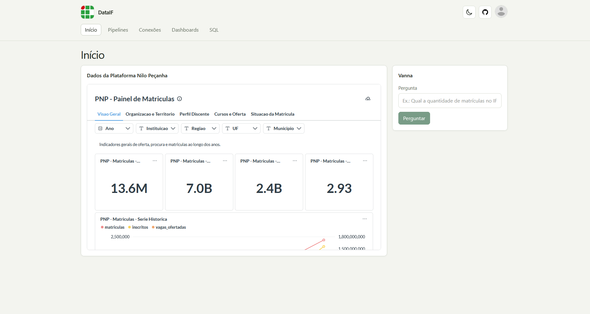
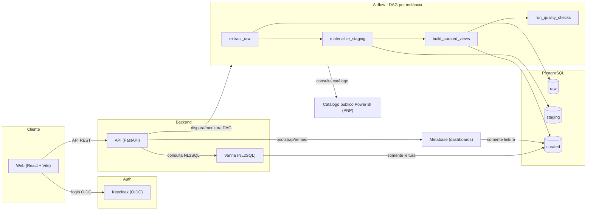
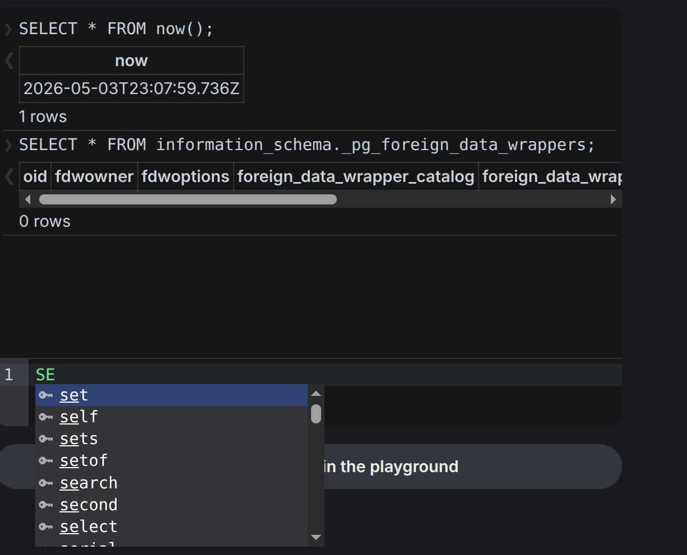
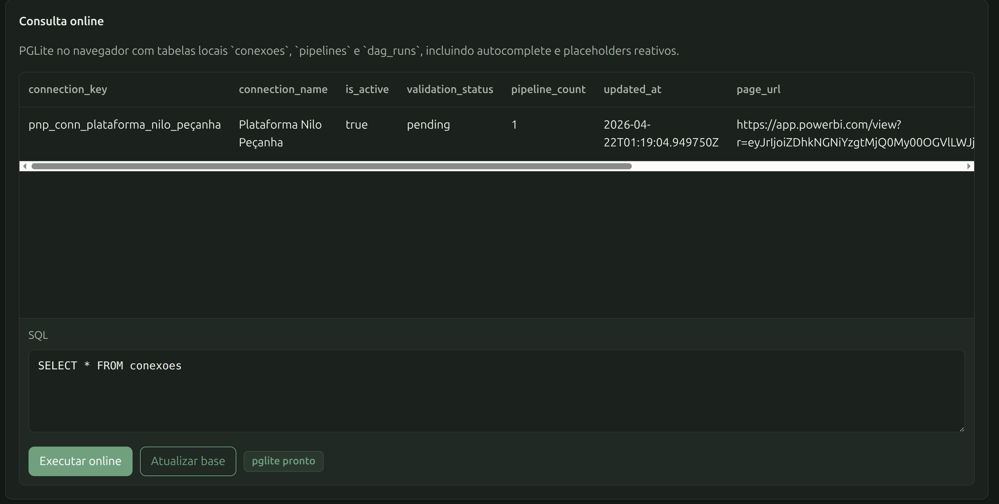

# DataIF

**Plataforma conteinerizada para ingestão, tratamento e consulta de dados públicos governamentais.**

[](LICENSE)




## Visão geral

O DataIF ingere dados públicos governamentais em PostgreSQL, com operação administrativa via API e UI, ingestão orquestrada no Airflow, dashboards no Metabase e consulta assistida via Vanna. O caso de uso atual é a integração com a **Plataforma Nilo Peçanha (PNP)**, consumindo o catálogo público de microdados via Power BI.

Destaques:
- **Ingestão automatizada**: uma DAG do Airflow cobre o fluxo completo, de `raw` até `curated`.
- **Administração via UI**: criação de conexões, disparo de pipelines e gestão de usuários administrativos (Keycloak + Metabase), tudo autenticado via OIDC.
- **Dashboards prontos**: Metabase embutido na própria aplicação.
- **Consulta em linguagem natural**: Vanna AI (NL2SQL) restrito ao schema `curated`, com provider local (Ollama) ou hospedado (Maritaca).
- **Playground de SQL no navegador**: consultas rápidas sem precisar do backend, rodando PGLite client-side.
- **Instalador próprio**: CLI npm (`@dataif/cli`) para preparar uma máquina nova sem precisar conhecer os scripts internos.

## Arquitetura



A UI autentica no Keycloak e opera via API. A API dispara e monitora as DAGs do Airflow, faz bootstrap/embed do Metabase e encaminha consultas em linguagem natural ao Vanna. Cada instância de conexão roda uma DAG própria no Airflow que cobre o fluxo completo — extração do catálogo público da PNP, carga em `raw`, materialização de `staging`, publicação de views em `curated` e checagens de qualidade — sem etapas manuais no meio. Metabase e Vanna só têm acesso de leitura ao schema `curated`.

Para o detalhamento completo (modelo de segurança, papéis de banco por serviço, fluxo de autenticação), veja [docs/ARCHITECTURE.md](docs/ARCHITECTURE.md).

## Stack

| Serviço | Imagem / tecnologia | Porta padrão | Função |
|---|---|---|---|
| `postgres` | `postgres:16-alpine` | `5433` | Banco único com schemas `raw`/`staging`/`curated`, além dos bancos de Airflow e Metabase |
| `airflow-webserver` / `airflow-scheduler` | Apache Airflow (imagem própria) | `8080` (via `/airflow/`) | Orquestração das DAGs de ingestão por instância |
| `api` | FastAPI (imagem própria) | `8000` (via `/api/`) | API administrativa, bootstrap de Metabase/Keycloak, proxy para Airflow e Vanna |
| `web` | React + Vite, servido via Nginx (imagem própria) | `80` (entrypoint único) | Frontend e reverse proxy para `/api`, `/airflow/`, `/metabase/` |
| `vanna` | Serviço próprio (porta `9000`) | `9000` | NL2SQL restrito ao schema `curated`, com Ollama ou Maritaca como LLM |
| `metabase` | `metabase/metabase:v0.60.1` | `3000` (via `/metabase/`) | Dashboards e embeds analíticos |
| `keycloak` | `quay.io/keycloak/keycloak:26.2` | `8080` | Identidade e login administrativo via OIDC |
| `ollama` *(opcional)* | `ollama/ollama` | `11434` | LLM local para o Vanna, ativado via `--llm` |

Todos os serviços sobem via Docker Compose ([infra/docker-compose.yml](infra/docker-compose.yml)); o `web` é o único ponto de entrada exposto ao usuário final.

## Estrutura do repositório

- `infra/`: Docker Compose, imagens e bootstrap da stack
- `pipelines/`: DAGs e conectores de ingestão (Airflow)
- `services/api/`: API administrativa e integrações (Airflow, Metabase, Keycloak, Vanna)
- `services/web/`: frontend React + Nginx (reverse proxy)
- `services/vanna/`: serviço de NL2SQL
- `sql/`: DDLs de schema, transformações de staging e views curadas
- `packages/dataif-cli/`: CLI npm (`@dataif/cli`) para instalar e operar a stack
- `scripts/`: scripts de deploy, configuração e utilitários de operação (Metabase, Vanna, PNP)
- `tests/`: testes da API, pipelines e Vanna
- `docs/`: arquitetura, fluxos de autenticação e material de apoio

## Como rodar localmente

### Pré-requisitos
- Docker Engine com Docker Compose v2
- Node.js 18+ para usar a CLI npm; recomendado Node.js 20
- 6 GB de RAM livres para stack básica (12 GB se usar Ollama local)
- 30 GB livres recomendados para imagens e volumes Docker em VM

### Quick start com scripts

```bash
./scripts/deploy.sh stg   # ambiente de teste/staging, imagens publicadas
./scripts/deploy.sh prod  # produção local em nova máquina
```

Acessos padrão após o deploy:
- Web: `http://localhost:15173`
- API: `/api` via Web
- Airflow: `/airflow/` via Web
- Metabase: `/metabase/` via Web

Versão padrão do Metabase: `METABASE_IMAGE_TAG=v0.60.1`.

Para desenvolvimento com build local e volumes de código:

```bash
./scripts/deploy.sh stg --build-local
```

Para recriar `infra/.env` de staging: `DATAIF_FORCE_ENV=true ./scripts/deploy.sh stg`.

Validar configuração sem subir:

```bash
cd infra
docker compose --env-file .env config >/dev/null
```

Ativar LLM local com Ollama: `./scripts/deploy.sh stg --llm` (ou `prod --llm`).

Refazer do zero:

```bash
cd infra
docker compose --env-file .env down -v
cd ..
./scripts/deploy.sh stg
```

Em VM Linux limpa, instale o Docker manualmente antes do deploy (veja exemplo para Oracle Linux/RHEL e detalhes de rede/NAT em [docs/VM_INSTALL.md](docs/VM_INSTALL.md)). Em VM pública, configure a `URL pública da aplicação` como a URL final do navegador (ex. `http://<ip>:5173`) — ela define os redirects do Airflow, a URL do Metabase, CORS e os links exibidos pelo CLI.

### Instalador npm

Também existe uma CLI npm para preparar uma máquina nova sem exigir que o usuário conheça os scripts internos:

```bash
npx @dataif/cli install
npx @dataif/cli deploy
npx @dataif/cli doctor
```

O instalador cria uma cópia local da stack em `~/.dataif/current`, valida Docker/Docker Compose, coleta as credenciais de forma interativa e então sobe os containers. O comando `doctor` valida Docker, Compose, endpoints da aplicação e logs dos serviços de bootstrap. Para usar uma pasta específica:

```bash
npx @dataif/cli install --dir ./dataif-local
npx @dataif/cli deploy --dir ./dataif-local --mode prod
npx @dataif/cli doctor --dir ./dataif-local
```

Por padrão, `deploy` usa imagens publicadas em `DATAIF_IMAGE_REGISTRY` com a tag fixa `DATAIF_IMAGE_TAG` do pacote. Para desenvolvimento local com rebuild e bind mounts de código, use `--build-local`:

```bash
npx @dataif/cli deploy --mode stg --build-local
```

Durante o desenvolvimento do pacote:

```bash
cd packages/dataif-cli
npm run smoke
npm pack --dry-run
```

### Troubleshooting

Para recuperar um deploy local inicializado com credenciais erradas, recrie os volumes explicitamente:

```bash
npx @dataif/cli deploy --dir ./dataif-local --mode prod --force-env --reset-volumes
```

`--reset-volumes` executa `docker compose down -v` e apaga dados locais da stack antes de subir novamente.

Configure senhas e `METABASE_EMBED_SECRET` antes do primeiro `up`, pois o Postgres inicializa usuários somente na criação do volume.

## Fluxo de dados da PNP

1. O admin acessa a área administrativa via Keycloak.
2. A UI consulta o catálogo público da PNP no Power BI.
3. O admin cria uma conexão selecionando anos, tipos e cron.
4. O Airflow dispara a DAG da instância, que executa em sequência: `register_run → load_instance_config → resolve_powerbi_catalog → select_execution_path → extract_raw → materialize_staging → build_curated_views → run_quality_checks → finalize_run`.
5. O conector baixa os arquivos públicos e grava manifestos em `raw.nilo_pecanha_assets` e linhas parseadas em `raw.nilo_pecanha_records`.
6. A própria DAG materializa `staging` e publica as views de `curated` — sem etapas manuais via SGBD.
7. Um branch `validate`-only pula direto para `finalize_run` quando a instância só precisa validar a fonte, sem ingerir dados.
8. Metabase e Vanna consomem exclusivamente a camada `curated`.

## Recursos da interface

O frontend inclui um playground de SQL que roda inteiramente no navegador (PGLite), sem depender do backend — útil para explorar o modelo de dados ou testar consultas rapidamente:





## Vanna AI local

O Vanna usa apenas relações qualificadas no schema `curated` e é chamado pela tela `Início`.

Para usar LLM local com Ollama:

```bash
./scripts/use-vanna-ollama.sh
```

O comando define `VANNA_LLM_PROVIDER=ollama`, preserva `VANNA_MARITACA_API_KEY`, sobe o serviço Ollama, carrega/importa o modelo configurado e reinicia o Vanna. Use `./scripts/use-vanna-ollama.sh --no-bootstrap` quando o modelo já existir no Ollama e você quiser pular apenas o bootstrap.

Mantenha `VANNA_ALLOWED_SCHEMA=curated`; novas tabelas, views e materialized views em `curated` entram no treinamento quando o `vanna_user` tiver `SELECT`.

A configuração efetiva de provider/modelo também pode ser ajustada pela tela `Configurações Admin`, com overrides persistidos em banco. Também é possível usar a API da Maritaca com `VANNA_LLM_PROVIDER=maritaca`, `VANNA_MARITACA_API_KEY` e `VANNA_MARITACA_MODEL=sabia-4`. Detalhes completos (SQLGuard, treinamento, variáveis de ambiente) em [docs/VANNA_CURATED_ONLY.md](docs/VANNA_CURATED_ONLY.md).

## Admins e Metabase

A tela `Configurações Admin` cria e remove usuários administrativos em dois sistemas: Keycloak (identidade de login) e Metabase (administradores da instância analítica). O vínculo entre eles usa o e-mail do usuário; se a criação no Metabase falhar, a API desfaz a criação correspondente no Keycloak para evitar estado parcial.

## Documentação adicional

| Documento | Conteúdo |
|---|---|
| [docs/ARCHITECTURE.md](docs/ARCHITECTURE.md) | Arquitetura completa: frontend, modelo de dados por camada, segurança e fluxo de autenticação |
| [docs/VANNA_CURATED_ONLY.md](docs/VANNA_CURATED_ONLY.md) | Fluxo detalhado do Vanna, SQLGuard, treinamento e providers de LLM |
| [docs/JWT_ADMIN_FLOW.md](docs/JWT_ADMIN_FLOW.md) | Fluxo de autenticação administrativa, credenciais locais e uso da API via token |
| [docs/VM_INSTALL.md](docs/VM_INSTALL.md) | Instalação em VM Linux limpa (Oracle Linux/VirtualBox NAT) |
| [docs/ANALISE_PNP_RAW_STAGING_CURATED.md](docs/ANALISE_PNP_RAW_STAGING_CURATED.md) | Modelagem de dados da PNP: tabelas raw, staging e views curadas |

## License

Este projeto está licenciado sob a licença MIT. Veja o arquivo [LICENSE](LICENSE) para mais detalhes.
